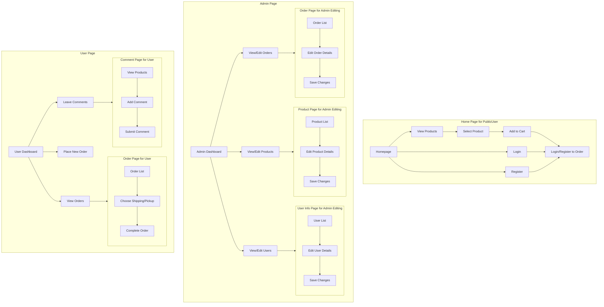

# Bubble Tea Merchandise Ecommerce System

A full-stack MERN (MongoDB, Express, React, Node.js) ecommerce platform for bubble tea merchandise, featuring a user-friendly shopping experience and an admin portal for order management.

## Live Website

Visit the live website: [BBT Project](http://ec2-54-255-232-252.ap-southeast-1.compute.amazonaws.com)


## Repositories

- Frontend: [https://github.com/bfcxfm/BBT-Merch](https://github.com/bfcxfm/BBT-Merch)
- Backend: [https://github.com/bfcxfm/BBT-BE](https://github.com/bfcxfm/BBT-BE)

## Project Structure

Our project is split into two main repositories:

1. **Frontend (BBT-Merch)**: Contains the React-based user interface, including all client-side logic and components.

2. **Backend (BBT-BE)**: Houses the Express.js server, API endpoints, database interactions, and business logic.

This separation allows for independent development and scaling of the frontend and backend components.

## Features

### Customer Portal

- **Product Browsing**: View and search for drink selection.
- **Price Check**: Easily view prices for all items.
- **Detailed Product Information**: See ingredients, percentage of drink components, sugar levels, and more for each product.
- **Customization Options**: Adjust sugar levels, ice levels, and toppings when ordering drinks.
- **Cart Management**: Add items to cart without signing in.
- **User Authentication**: Sign in required to place an order.
- **Order Placement**: Secure checkout process for registered users.
- **Order Tracking**: Track order status and history.


### Admin Portal

- **Order Management**: Confirm or cancel orders.
- **Cost Management**: Revenue, cost and user count.
- **Product Management**: Add new products or edit existing ones, including detailed ingredient and component information.
- **Inventory Control**: Monitor and update stock levels for products and ingredients.


## Animations


## Responsive Design

Our application is built with a mobile-first approach, ensuring a seamless experience across all devices:

- **Desktop**: Full-featured interface with optimized layouts for larger screens.
- **Tablet**: Adaptive design that adjusts to medium-sized screens.
- **Mobile**: Streamlined interface for easy navigation and interaction on smaller screens.


## Dark Mode

The application supports system-based dark mode:

- Automatically switches between light and dark themes based on user's system preferences.
- Carefully designed color palette for both modes to ensure readability and reduce eye strain.
- Consistent styling across all components in both light and dark modes.




## Tech Stack

### Frontend

- React.js
- shadcn UI components
- Tailwind CSS for styling

### Backend

- Node.js with Express.js

### Database

- MongoDB

### Authentication

- JSON Web Tokens (JWT)

### Deployment

- AWS EC2
- Nginx as reverse proxy

## Deployment

The application is deployed on an AWS EC2 instance with Nginx serving as a reverse proxy. This setup ensures that the backend is not directly exposed to the public internet, enhancing security.

### Nginx Configuration

```nginx
server {
    listen 80;
    server_name xxx.compute.amazonaws.com;

    location / {
        root /home/ec2-user/.../dist;
        try_files $uri $uri/ /index.html;
    }

    location /api {
        proxy_pass http://localhost:3000/;
        proxy_http_version 1.1;
        proxy_set_header Upgrade $http_upgrade;
        proxy_set_header Connection 'upgrade';
        proxy_set_header Host $host;
        proxy_cache_bypass $http_upgrade;
    }
}
```

This configuration serves the frontend from the `/dist` directory and proxies API requests to the local backend server running on port 3000.

## Getting Started

1. Clone the repository:

   ```
   git clone https://github.com/bfcxfm/BBT-Merch.git
   ```

2. Install dependencies:

   ```
   cd BBT-Merch
   npm install
   ```

3. Set up environment variables:

   ```
   cp .env.example .env
   ```

   Edit the `.env` file with your configuration.

4. Run the development server:

   ```
   npm run dev
   ```

5. Run the development build on server:

   ```
   npm run build
   ```

## Key Features in Detail

### Detailed Product Information

- Users can view comprehensive details for each bubble tea product, including:
  - Full list of ingredients
  - Percentage breakdown of drink components (e.g., 70% tea, 30% milk)
  - Available sugar and level options (0%, 25%, 50%, 75%, 100%)

### Customization

- Users can customize their drinks with options for:
  - Sugar level
  - Ice level
  - Additional toppings
    -comments

### Admin Product Management

- Admins can input and edit detailed product information, including:
  - Ingredient lists
  - Component percentages
  - Customization options
  - Revenue, cost and user management

# Future Features

Here are some exciting features we plan to implement in the near future:

### Enhanced Product Customization

- **Real-time Ingredient Updates**: As users customize their drinks, the ingredient list will update in real-time, reflecting the exact composition of their custom order.

### Nutritional Information

- **Dynamic Calorie Calculation**: Calorie information will be calculated and displayed in real-time as users customize their drinks, helping them make informed choices.

### Allergen Awareness

- **Allergen Warnings**: Clear allergen warnings will be displayed for each product, updating dynamically based on customization choices to ensure customer safety.

### Expanded Customization Options

- **Broader Ingredient Selection**: Introduce a wider range of toppings, syrups, and tea bases for even more personalized drinks.

### Sustainability Features

- **Eco-friendly Packaging Options**: Allow customers to choose environmentally friendly packaging alternatives.
- **Carbon Footprint Tracking**: Display the environmental impact of each order and offer options to offset it.

### Advanced User Profiles

- **Favorite Orders**: Enable users to save and quickly reorder their favorite drink combinations.
- **Personalized Recommendations**: Implement an AI-driven system to suggest new drinks based on user preferences and order history.

## License

This project is licensed under the MIT License - see the [LICENSE](LICENSE) file for details.
